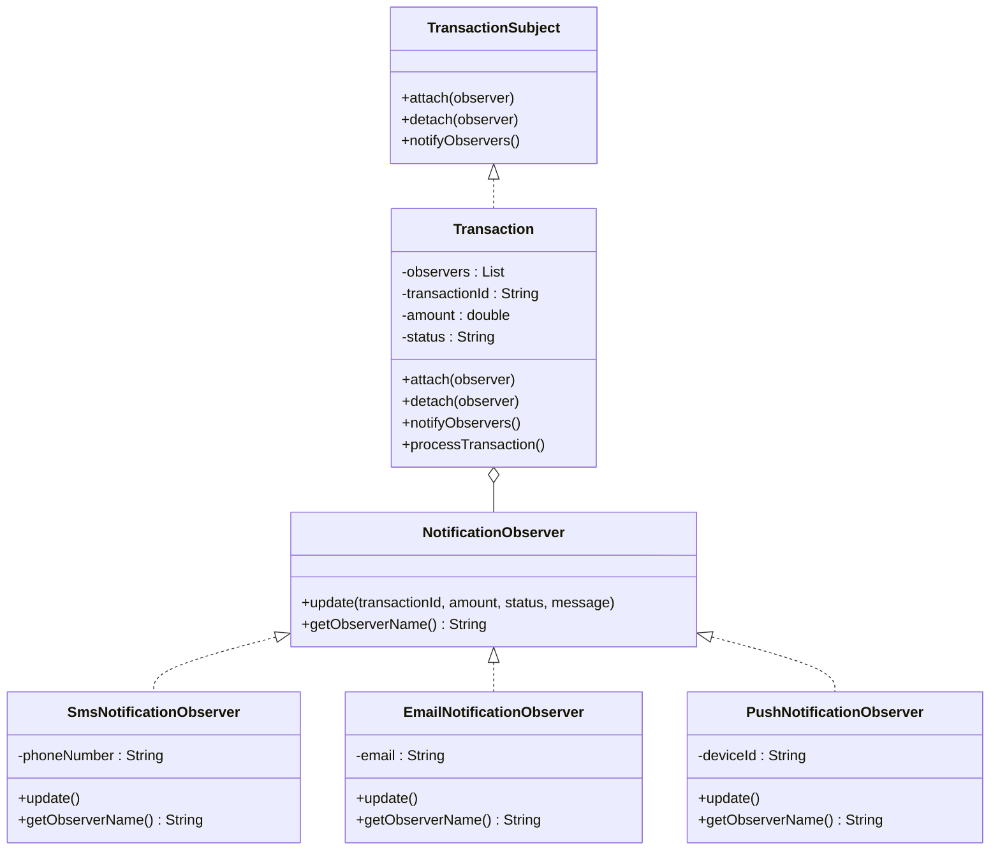

# Observer Design Pattern 🔔

## Overview
The **Observer Pattern** is a behavioral design pattern that defines a one-to-many dependency between objects. When one object (the Subject) changes state, all its dependents (Observers) are notified and updated automatically.

## Real-World Analogy 🌍
Think of **YouTube subscriptions**:
- **Subject**: YouTube Channel
- **Observers**: Subscribers
- **Event**: New video uploaded

When a channel uploads a video (state change), all subscribers get notified automatically. Subscribers can subscribe/unsubscribe anytime without affecting the channel.

---

## Problem It Solves ❌

### Without Observer Pattern:
```java
public void processTransaction(String id, double amount) {
    // Process transaction...
    
    // Hardcoded notification logic
    sendSMS("+91-9876543210", "Transaction successful");
    sendEmail("user@example.com", "Transaction successful");
    sendPush("device-123", "Transaction successful");
    
    // What if user wants to disable SMS? Need to modify code!
    // What if we add WhatsApp notifications? Need to modify code!
}
```

**Problems:**
- ❌ Tight coupling between transaction and notifications
- ❌ Hard to add/remove notification channels
- ❌ Violates Open/Closed Principle
- ❌ Transaction class has too many responsibilities

### With Observer Pattern:
```java
Transaction transaction = new Transaction();
transaction.attach(new SmsNotificationObserver("+91-9876543210"));
transaction.attach(new EmailNotificationObserver("user@example.com"));

transaction.processTransaction("TXN001", 5000, "SUCCESS", "Payment received");
// All observers are notified automatically!
```

**Benefits:**
- ✅ Loose coupling
- ✅ Easy to add/remove observers at runtime
- ✅ Follows Single Responsibility Principle
- ✅ Follows Open/Closed Principle

---

## Structure 🏗️



### Components:

1. **Observer Interface** ([NotificationObserver.java](file:///path/to/project/design-patterns/behavioral/observer/NotificationObserver.java))
   - Defines `update()` method that all observers must implement

2. **Subject Interface** ([TransactionSubject.java](file:///path/to/project/design-patterns/behavioral/observer/TransactionSubject.java))
   - Defines `attach()`, `detach()`, and `notifyObservers()` methods

3. **Concrete Observers**
   - [SmsNotificationObserver.java](file:///path/to/project/design-patterns/behavioral/observer/SmsNotificationObserver.java) - SMS notifications
   - [EmailNotificationObserver.java](file:///path/to/project/design-patterns/behavioral/observer/EmailNotificationObserver.java) - Email notifications
   - [PushNotificationObserver.java](file:///path/to/project/design-patterns/behavioral/observer/PushNotificationObserver.java) - Push notifications

4. **Concrete Subject** ([Transaction.java](file:///path/to/project/design-patterns/behavioral/observer/Transaction.java))
   - Maintains list of observers
   - Notifies all observers when transaction occurs

---

## Fintech Use Cases 💰

### 1. **Transaction Notifications** (Our Example)
Notify users via SMS, Email, Push when transactions occur

### 2. **Stock Price Alerts**
Notify investors when stock prices hit target levels

### 3. **Account Balance Alerts**
Notify when balance falls below threshold

### 4. **Fraud Detection Alerts**
Notify security team when suspicious activity detected

### 5. **Payment Status Updates**
Notify merchants when payment status changes

---

## When to Use Observer Pattern? 🤔

✅ **Use when:**
- One object's state change should trigger updates in multiple other objects
- You want loose coupling between objects
- You need to add/remove observers dynamically at runtime
- You're building event-driven systems

❌ **Don't use when:**
- You have a simple one-to-one relationship
- Observers don't need to be notified of every change
- Performance is critical (notifying many observers can be slow)

---

## How to Run 🚀

### From the `oops` directory (Recommended):

```bash
# Navigate to the oops directory
cd /path/to/project

# Compile with package structure
javac -d . design-patterns/behavioral/observer/*.java

# Run the demo
java behavioral.observer.ObserverPatternDemo
```

### From the `observer` directory:

```bash
# Navigate to the observer pattern directory
cd /path/to/project/design-patterns/behavioral/observer

# Compile all files
javac *.java

# Go back to oops directory to run
cd /path/to/project
java behavioral.observer.ObserverPatternDemo
```

---

## Key Principles 📖

### SOLID Principles Applied:

1. **Single Responsibility Principle (SRP)**
   - Transaction handles transaction logic
   - Each observer handles its own notification logic

2. **Open/Closed Principle (OCP)**
   - Open for extension: Add new observers without modifying Transaction
   - Closed for modification: Transaction code doesn't change

3. **Dependency Inversion Principle (DIP)**
   - Transaction depends on NotificationObserver interface, not concrete classes

---

## Observer vs Strategy Pattern 🤔

| Aspect | Observer | Strategy |
|--------|----------|----------|
| **Purpose** | One-to-many notification | Interchangeable algorithms |
| **Relationship** | Subject has many Observers | Context has one Strategy |
| **Trigger** | Automatic (when state changes) | Manual (client chooses) |
| **Example** | Transaction → Multiple notifications | Payment → One payment method |

---

## Extending the Pattern 🔧

### Adding a New Observer (e.g., WhatsApp):

```java
public class WhatsAppNotificationObserver implements NotificationObserver {
    private String phoneNumber;
    
    public WhatsAppNotificationObserver(String phoneNumber) {
        this.phoneNumber = phoneNumber;
    }
    
    @Override
    public void update(String transactionId, double amount, String status, String message) {
        System.out.println("💬 WhatsApp notification sent to " + phoneNumber);
        // WhatsApp notification logic
    }
    
    @Override
    public String getObserverName() {
        return "WhatsApp Notification";
    }
}
```

**Usage:**
```java
transaction.attach(new WhatsAppNotificationObserver("+91-9876543210"));
```

**That's it!** No need to modify Transaction class. This is the power of Observer Pattern! 🎉

---

## Common Pitfalls ⚠️

1. **Memory Leaks** - Always detach observers when no longer needed
2. **Order Dependency** - Don't assume observers are notified in a specific order
3. **Circular Dependencies** - Avoid observers that trigger updates back to the subject
4. **Too Many Notifications** - Can impact performance if you have many observers

---

## Related Patterns 🔗

- **Mediator Pattern** - Centralizes complex communications between objects
- **Event Bus** - More advanced pub-sub system
- **MVC Pattern** - Model notifies View when data changes (uses Observer)

---

## Summary 📝

The Observer Pattern is perfect for fintech applications where:
- Multiple systems need to react to transaction events
- Notification channels can be added/removed dynamically
- Loose coupling between transaction processing and notifications is essential

**Remember:** Observer Pattern = Automatic one-to-many notifications! 🔔
