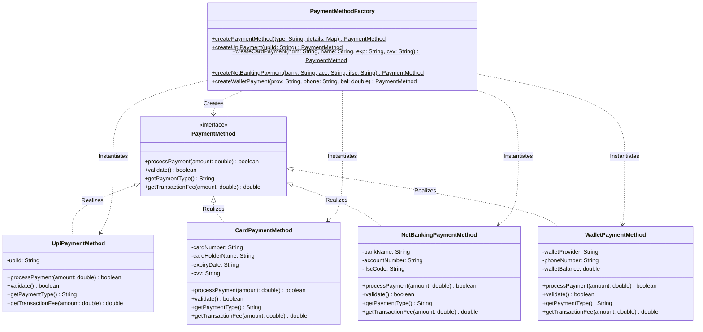

# Factory Method Design Pattern 🏭

## Overview
The **Factory Method Pattern** is a creational design pattern that provides an interface for creating objects, but lets subclasses or a factory class decide which class to instantiate. It centralizes object creation logic and decouples the client code from concrete classes.

## Real-World Analogy 🌍
Think of a **Car Factory**:
- **Client**: You (the customer)
- **Factory**: Car manufacturing plant
- **Products**: Different car models (Sedan, SUV, Hatchback)

You don't build the car yourself. You just tell the factory "I want a sedan," and the factory handles all the complex assembly work and gives you a ready-made car.

---

## Problem It Solves ❌

### Without Factory Pattern:
```java
public void processPayment(String type) {
    PaymentMethod payment;
    
    // Messy if-else or switch statements everywhere!
    if (type.equals("UPI")) {
        payment = new UpiPaymentMethod("user@upi");
    } else if (type.equals("CARD")) {
        payment = new CardPaymentMethod("1234...", "John", "12/25", "123");
    } else if (type.equals("NET_BANKING")) {
        payment = new NetBankingPaymentMethod("HDFC", "123...", "HDFC...");
    } else if (type.equals("WALLET")) {
        payment = new WalletPaymentMethod("Paytm", "9876...", 5000);
    }
    
    // What if we add a new payment method? Modify code everywhere!
    // What if creation logic becomes complex? Duplicate code everywhere!
}
```

**Problems:**
- ❌ Client code knows about all concrete classes
- ❌ Creation logic scattered across codebase
- ❌ Hard to add new payment methods
- ❌ Violates Open/Closed Principle
- ❌ Code duplication

### With Factory Pattern:
```java
public void processPayment(String type) {
    // Clean and simple!
    PaymentMethod payment = PaymentMethodFactory.createPaymentMethod(type, details);
    payment.processPayment(amount);
}
```

**Benefits:**
- ✅ Client doesn't know concrete classes
- ✅ Creation logic centralized
- ✅ Easy to add new payment methods
- ✅ Follows Open/Closed Principle
- ✅ No code duplication

---

## Structure 🏗️



### Components:

1. **Product Interface** ([PaymentMethod.java](file:///Users/uttamsharma/Desktop/java/oops/design-patterns/creational/factory/PaymentMethod.java))
   - Defines common interface for all products

2. **Concrete Products**
   - [UpiPaymentMethod.java](file:///Users/uttamsharma/Desktop/java/oops/design-patterns/creational/factory/UpiPaymentMethod.java) - UPI payments
   - [CardPaymentMethod.java](file:///Users/uttamsharma/Desktop/java/oops/design-patterns/creational/factory/CardPaymentMethod.java) - Card payments
   - [NetBankingPaymentMethod.java](file:///Users/uttamsharma/Desktop/java/oops/design-patterns/creational/factory/NetBankingPaymentMethod.java) - Net Banking
   - [WalletPaymentMethod.java](file:///Users/uttamsharma/Desktop/java/oops/design-patterns/creational/factory/WalletPaymentMethod.java) - Wallet payments

3. **Factory** ([PaymentMethodFactory.java](file:///Users/uttamsharma/Desktop/java/oops/design-patterns/creational/factory/PaymentMethodFactory.java))
   - Centralizes object creation logic
   - Decides which concrete class to instantiate

---

## Fintech Use Cases 💰

### 1. **Payment Method Creation** (Our Example)
Create different payment objects based on user selection

### 2. **Account Creation**
Factory creates different account types (Savings, Current, Demat)

### 3. **Loan Processing**
Factory creates different loan types (Home, Personal, Car)

### 4. **Card Issuance**
Factory creates different card types (Credit, Debit, Prepaid)

### 5. **Report Generation**
Factory creates different report formats (PDF, Excel, CSV)

---

## When to Use Factory Pattern? 🤔

✅ **Use when:**
- Object creation logic is complex
- You want to centralize creation logic
- You don't want client to know concrete class names
- You need to add new product types frequently
- Creation depends on runtime conditions

❌ **Don't use when:**
- Object creation is simple (just `new Object()`)
- You only have one or two product types
- Creation logic never changes

---

## How to Run 🚀

### From the `oops` directory (Recommended):

```bash
# Navigate to the oops directory
cd /Users/uttamsharma/Desktop/java/oops

# Compile with package structure
javac -d . design-patterns/creational/factory/*.java

# Run the demo
java creational.factory.FactoryPatternDemo
```

### From the `factory` directory:

```bash
# Navigate to the factory pattern directory
cd /Users/uttamsharma/Desktop/java/oops/design-patterns/creational/factory

# Compile all files
javac *.java

# Go back to oops directory to run
cd /Users/uttamsharma/Desktop/java/oops
java creational.factory.FactoryPatternDemo
```

---

## Key Principles 📖

### SOLID Principles Applied:

1. **Single Responsibility Principle (SRP)**
   - Factory handles creation
   - Products handle their own logic

2. **Open/Closed Principle (OCP)**
   - Open for extension: Add new products without modifying factory much
   - Closed for modification: Client code doesn't change

3. **Dependency Inversion Principle (DIP)**
   - Client depends on PaymentMethod interface, not concrete classes

---

## Factory vs Strategy vs Observer 🤔

| Aspect | Factory | Strategy | Observer |
|--------|---------|----------|----------|
| **Category** | Creational | Behavioral | Behavioral |
| **Purpose** | Object creation | Algorithm selection | Event notification |
| **Focus** | HOW to create | HOW to execute | HOW to notify |
| **Example** | Create payment object | Execute payment | Notify after payment |

**They work together!**
- Use **Factory** to create payment objects
- Use **Strategy** to execute different payment algorithms
- Use **Observer** to notify when payment completes

---

## Extending the Pattern 🔧

### Adding a New Payment Method (e.g., Cryptocurrency):

**Step 1:** Create the product class
```java
public class CryptoPaymentMethod implements PaymentMethod {
    // Implementation
}
```

**Step 2:** Update the factory
```java
public class PaymentMethodFactory {
    public static PaymentMethod createPaymentMethod(String type, ...) {
        switch (type) {
            // ... existing cases
            case "CRYPTO":
                return new CryptoPaymentMethod(...);
        }
    }
}
```

**That's it!** Client code doesn't change at all! 🎉

---

## Common Pitfalls ⚠️

1. **Over-engineering** - Don't use factory for simple object creation
2. **God Factory** - Don't make one factory create everything
3. **Tight Coupling** - Factory shouldn't depend on too many concrete classes
4. **Missing Validation** - Always validate inputs in factory methods

---

## Related Patterns 🔗

- **Abstract Factory** - Factory of factories (creates families of related objects)
- **Builder Pattern** - Step-by-step object construction
- **Prototype Pattern** - Clone existing objects instead of creating new ones
- **Singleton Pattern** - Often used with Factory to ensure single factory instance

---

## Summary 📝

The Factory Pattern is perfect for fintech applications where:
- Multiple payment/account/loan types need to be created
- Creation logic is complex or may change
- You want to hide concrete class details from clients
- You need flexibility to add new types easily

**Remember:** Factory Pattern = Centralized object creation! 🏭
