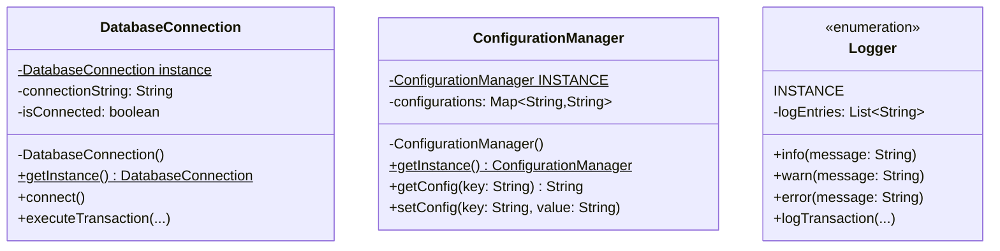

# Singleton Design Pattern 🔒

## Overview
The **Singleton Pattern** is a creational design pattern that ensures a class has only ONE instance and provides a global point of access to that instance. It's one of the most commonly used (and sometimes misused) patterns in software development.

## Real-World Analogy 🌍
Think of a **Country's President**:
- **Singleton**: There can be only ONE president at a time
- **Global Access**: Everyone in the country knows who the president is
- **Single Point of Control**: All executive decisions go through this one person

In software, just like a country needs one president, an application needs one configuration manager, one database connection pool, or one logging system.

---

## Problem It Solves ❌

### Without Singleton Pattern:
```java
public class PaymentService {
    DatabaseConnection db = new DatabaseConnection(); // New instance
    ConfigManager config = new ConfigManager();       // Another new instance
}

public class ReportService {
    DatabaseConnection db = new DatabaseConnection(); // Yet another instance!
    ConfigManager config = new ConfigManager();       // Duplicate configs!
}
```

**Problems:**
- ❌ Multiple instances waste memory
- ❌ Inconsistent state (each instance has different data)
- ❌ Resource exhaustion (too many database connections)
- ❌ Configuration conflicts

### With Singleton Pattern:
```java
public class PaymentService {
    DatabaseConnection db = DatabaseConnection.getInstance(); // Same instance
    ConfigManager config = ConfigManager.getInstance();       // Same instance
}

public class ReportService {
    DatabaseConnection db = DatabaseConnection.getInstance(); // Same instance!
    ConfigManager config = ConfigManager.getInstance();       // Same instance!
}
```

**Benefits:**
- ✅ Only one instance exists
- ✅ Consistent state across application
- ✅ Resource optimization
- ✅ Global access point

---

## Structure 🏗️



### Implementation Approaches:

#### 1. **Bill Pugh Singleton** (Recommended for most cases)
- Thread-safe without synchronization
- Lazy initialization
- Used in: `DatabaseConnection.java`

#### 2. **Eager Initialization**
- Simple and thread-safe
- Instance created at class loading
- Used in: `ConfigurationManager.java`

#### 3. **Enum Singleton** (Best practice)
- Inherently thread-safe and serialization-safe
- Cannot be broken by reflection
- Used in: `Logger.java`

### Components:

1. **DatabaseConnection** ([DatabaseConnection.java](file:///path/to/project/design-patterns/creational/singleton/DatabaseConnection.java))
   - Bill Pugh Singleton pattern
   - Thread-safe lazy initialization
   - Database connection management

2. **ConfigurationManager** ([ConfigurationManager.java](file:///path/to/project/design-patterns/creational/singleton/ConfigurationManager.java))
   - Eager initialization
   - Application-wide configuration
   - Tax rates, limits, API keys

3. **Logger** ([Logger.java](file:///path/to/project/design-patterns/creational/singleton/Logger.java))
   - Enum-based singleton
   - Centralized transaction logging
   - Audit trail for compliance

---

## Fintech Use Cases 💰

### 1. **Database Connection Pool** (Our Example)
Single connection pool shared across all services

### 2. **Configuration Management**
Application settings accessed globally (API keys, tax rates, limits)

### 3. **Logging and Audit Trail**
Centralized logging for compliance and debugging

### 4. **Cache Manager**
Single cache instance to avoid data duplication

### 5. **Session Manager**
User session data maintained in one place

### 6. **Payment Gateway Client**
Single instance for API rate limiting

---

## When to Use Singleton Pattern? 🤔

✅ **Use when:**
- You need exactly ONE instance of a class
- Global access point is beneficial
- Resource management is critical (DB connections, file handles)
- State needs to be shared across the system
- Configuration needs to be consistent

❌ **Don't use when:**
- You might need multiple instances in the future
- Testing becomes difficult (hard to mock)
- It introduces global state (can lead to tight coupling)
- Concurrency control is complex

---

## How to Run 🚀

### From the `oops` directory (Recommended):

```bash
# Navigate to the oops directory
cd /path/to/project

# Compile with package structure
javac -d . design-patterns/creational/singleton/*.java

# Run the demo
java creational.singleton.SingletonPatternDemo
```

### From the `singleton` directory:

```bash
# Navigate to the singleton pattern directory
cd /path/to/project/design-patterns/creational/singleton

# Compile all files
javac *.java

# Go back to oops directory to run
cd /path/to/project
java creational.singleton.SingletonPatternDemo
```

---

## Key Principles 📖

### SOLID Principles Applied:

1. **Single Responsibility Principle (SRP)**
   - Singleton manages both instance creation AND its primary responsibility
   - ⚠️ Can violate SRP if not careful

2. **Open/Closed Principle (OCP)**
   - Closed for instantiation (private constructor)
   - Open for extension (can be subclassed with care)

3. **Dependency Inversion Principle (DIP)**
   - Clients depend on the singleton's public interface
   - Implementation details are hidden

---

## Thread Safety Comparison 🔒

| Approach | Thread-Safe | Lazy Loading | Performance | Complexity |
|----------|-------------|--------------|-------------|------------|
| **Bill Pugh** | ✅ Yes | ✅ Yes | ⭐⭐⭐⭐⭐ Excellent | Medium |
| **Eager Init** | ✅ Yes | ❌ No | ⭐⭐⭐⭐ Good | Low |
| **Enum** | ✅ Yes | ❌ No | ⭐⭐⭐⭐⭐ Excellent | Low |
| **Synchronized** | ✅ Yes | ✅ Yes | ⭐⭐ Poor | Low |
| **Double-Check** | ✅ Yes | ✅ Yes | ⭐⭐⭐⭐ Good | High |

**Recommendation:** Use **Enum** for simple cases, **Bill Pugh** when you need lazy loading.

---

## Singleton vs Factory vs Other Patterns 🤔

| Aspect | Singleton | Factory | Builder |
|--------|-----------|---------|---------|
| **Category** | Creational | Creational | Creational |
| **Purpose** | One instance | Object creation | Step-by-step construction |
| **Instances** | Exactly 1 | Multiple | Multiple |
| **Focus** | Instance control | Type selection | Complex construction |
| **Example** | Logger | PaymentMethodFactory | TransactionBuilder |

**They work together!**
- Use **Singleton** for the factory itself (one factory, many products)
- Use **Factory** to create different payment types
- Use **Builder** when construction is complex

---

## Common Pitfalls ⚠️

### 1. **Breaking Singleton with Reflection**
```java
Constructor<DatabaseConnection> constructor = DatabaseConnection.class.getDeclaredConstructor();
constructor.setAccessible(true);
DatabaseConnection fake = constructor.newInstance(); // Breaks singleton!
```
**Solution:** Use enum-based singleton (immune to reflection)

### 2. **Serialization Issues**
```java
// Deserialization creates a new instance!
```
**Solution:** Implement `readResolve()` method or use enum

### 3. **Testing Difficulties**
Hard to mock singletons for unit tests

**Solution:** Use dependency injection or make getInstance() accept parameters for testing

### 4. **Global State Problems**
Singletons introduce global state, leading to tight coupling

**Solution:** Use sparingly, consider alternatives like dependency injection

---

## Breaking the Singleton (Anti-patterns)

### ❌ Ways to Break Singleton:
1. Reflection
2. Serialization/Deserialization
3. Cloning
4. Multiple ClassLoaders

### ✅ Protection Mechanisms:
1. **Enum** - Immune to all attacks
2. **Prevent cloning** - Override `clone()` to throw exception
3. **Prevent serialization issues** - Implement `readResolve()`
4. **Prevent reflection** - Throw exception in constructor if instance exists

---

## Extending the Pattern 🔧

### Making Singleton Testable:

```java
public class ConfigurationManager {
    private static ConfigurationManager instance;
    
    // Allow injection for testing
    public static void setInstance(ConfigurationManager testInstance) {
        instance = testInstance;
    }
    
    public static ConfigurationManager getInstance() {
        if (instance == null) {
            instance = new ConfigurationManager();
        }
        return instance;
    }
}
```

---

## Related Patterns 🔗

- **Factory Pattern** - Factory itself is often a Singleton
- **Abstract Factory** - Can use Singleton for the factory instances
- **Builder Pattern** - Builder can be a Singleton
- **Facade Pattern** - Facade is often implemented as Singleton
- **State Pattern** - State instances can be Singletons

---

## Summary 📝

The Singleton Pattern is perfect for fintech applications where:
- Resource management is critical (connection pools, caches)
- Configuration needs to be consistent
- Centralized logging is required for compliance
- Global access to shared state is beneficial

**Key Takeaways:**
- ✅ Use **Enum** for simple singletons (best practice)
- ✅ Use **Bill Pugh** when you need lazy loading
- ✅ Use **Eager** when instance is lightweight and always needed
- ⚠️ Be cautious of testing difficulties
- ⚠️ Avoid overusing (can lead to tight coupling)

**Remember:** Singleton Pattern = ONE instance, GLOBAL access! 🔒

---

## Interview Tips 💡

When asked about Singleton in interviews:

1. **Mention the three main approaches** (Eager, Bill Pugh, Enum)
2. **Discuss thread safety** - Always talk about concurrency
3. **Know the drawbacks** - Testing, global state, tight coupling
4. **Suggest enum** - Show you know modern best practices
5. **Explain breaking mechanisms** - Reflection, serialization, cloning
6. **Give real examples** - Logger, Config, DB connection
