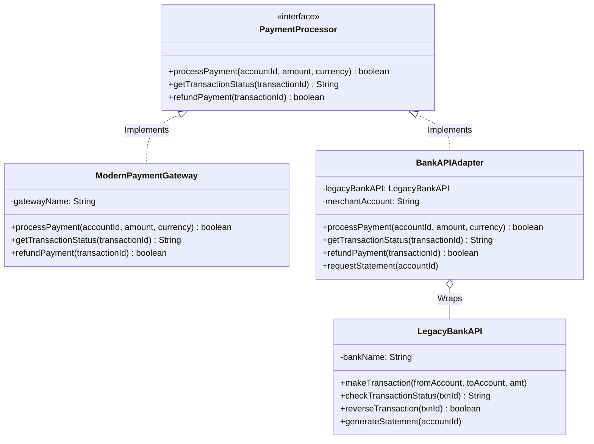

# Adapter Pattern 🔌

## Overview

The **Adapter Pattern** is a structural design pattern that allows objects with incompatible interfaces to work together. It acts as a bridge between two incompatible interfaces by wrapping an existing class with a new interface.

### Real-World Analogy 🌍
Think of a **power adapter** when traveling internationally:
- Your laptop charger (US plug) needs to work with UK power outlets
- The adapter converts the plug format without changing the charger itself
- Both power sources work, just with different interfaces

---

## Problem Statement 💡

In fintech applications, you often need to integrate with multiple payment providers:
- **Modern Payment Gateways** (Razorpay, Stripe, PhonePe) have standardized REST APIs
- **Legacy Bank APIs** use older protocols with different method signatures
- **Challenge**: Your application code expects a unified interface, but each provider has its own

Without the Adapter pattern, you would need to:
- ❌ Rewrite legacy code (risky and expensive)
- ❌ Create conditional logic everywhere (messy)
- ❌ Duplicate code for each provider (unmaintainable)

---

## Solution ✅

Create **Adapter** classes that:
1. Implement your application's expected interface (Target)
2. Wrap the legacy/incompatible class (Adaptee)
3. Translate method calls between the two interfaces

---

## Structure 🏗️



### Components:

1. **Target Interface** ([PaymentProcessor.java](PaymentProcessor.java))
   - Defines the standard interface expected by client code
   - Methods: `processPayment()`, `getTransactionStatus()`, `refundPayment()`

2. **Adaptee** ([LegacyBankAPI.java](LegacyBankAPI.java))
   - The existing class with an incompatible interface
   - Has methods: `makeTransaction()`, `checkTransactionStatus()`, `reverseTransaction()`
   - Cannot be modified (third-party or legacy code)

3. **Adapter** ([BankAPIAdapter.java](BankAPIAdapter.java))
   - Implements the Target interface
   - Contains a reference to the Adaptee
   - Translates calls from Target interface to Adaptee methods
   - Handles currency conversion and parameter mapping

4. **Native Implementation** ([ModernPaymentGateway.java](ModernPaymentGateway.java))
   - Direct implementation of PaymentProcessor
   - Shows the contrast with the adapted version

5. **Demo** ([AdapterPatternDemo.java](AdapterPatternDemo.java))
   - Demonstrates polymorphic usage of both adapted and native implementations

---

## Key Features ⭐

### 1. **Interface Translation**
```java
// Modern interface expects this:
processor.processPayment(accountId, amount, currency);

// Legacy API requires this:
legacyAPI.makeTransaction(fromAccount, toAccount, amt);

// Adapter translates:
public boolean processPayment(String accountId, double amount, String currency) {
    legacyBankAPI.makeTransaction(accountId, merchantAccount, amount);
    return true;
}
```

### 2. **Currency Conversion**
The adapter handles automatic currency conversion:
```java
if (!currency.equals("INR")) {
    amount = amount * 83.0; // Convert to INR
}
```

### 3. **Polymorphism**
Client code works with any `PaymentProcessor` implementation:
```java
PaymentProcessor[] processors = {
    new ModernPaymentGateway("PhonePe"),
    new BankAPIAdapter(new LegacyBankAPI("SBI"), "MERCHANT200"),
    new ModernPaymentGateway("Stripe")
};

for (PaymentProcessor processor : processors) {
    processor.processPayment(accountId, amount, currency); // Works for all!
}
```

---

## When to Use 🤔

✅ **Use the Adapter pattern when:**
- You need to integrate with legacy systems without modifying them
- You want to reuse existing classes with incompatible interfaces
- You need to work with third-party libraries that don't match your interface
- You want to create a unified interface for multiple implementations

❌ **Avoid when:**
- You can modify the source code directly
- The interfaces are already compatible
- You're adding unnecessary abstraction layers

---

## Benefits 📈

1. **Single Responsibility Principle**: Separates interface conversion from business logic
2. **Open/Closed Principle**: Add new adapters without modifying existing code
3. **Reusability**: Multiple adapters can wrap the same adaptee
4. **Testability**: Easy to mock and test individual components

---

## Real-World Applications 🌐

### FinTech Examples:
- **Payment Gateway Integration**: Unify Razorpay, Stripe, PayPal APIs
- **Bank API Integration**: Adapt SOAP-based bank APIs to REST
- **Currency Conversion**: Handle multi-currency transactions
- **Legacy System Migration**: Gradually migrate from old to new systems

### Other Industries:
- **Database Adapters**: JDBC adapters for different databases
- **Logging Frameworks**: SLF4J adapts Log4j, Logback, etc.
- **UI Libraries**: Adapt different GUI frameworks

---

## Code Example 💻

### Running the Demo:

```bash
# Compile
javac *.java

# Run
java AdapterPatternDemo
```

### Expected Output:

```
═══════════════════════════════════════════════════════════════
        ADAPTER PATTERN - FINTECH INTEGRATION DEMO
═══════════════════════════════════════════════════════════════

📱 SCENARIO 1: Processing with Modern Payment Gateway
─────────────────────────────────────────────────────────────
╔══════════════════════════════════════════════════════════╗
║  MODERN PAYMENT GATEWAY                              ║
╠══════════════════════════════════════════════════════════╣
║  Gateway: Razorpay
║  Amount: INR 5000.00
║  Status: PROCESSED ✓
╚══════════════════════════════════════════════════════════╝

🏦 SCENARIO 2: Processing with Legacy Bank API (via Adapter)
─────────────────────────────────────────────────────────────
🔌 Adapter initialized for merchant account: MERCHANT789
🔄 ADAPTER: Converting modern payment request to legacy format...
╔══════════════════════════════════════════════════════════╗
║  LEGACY BANK API TRANSACTION                         ║
╠══════════════════════════════════════════════════════════╣
║  Bank: HDFC Bank
║  From Account: CUST456789
║  Amount: ₹3000.00
║  Status: SUCCESS ✓
╚══════════════════════════════════════════════════════════╝
```

---

## Comparison with Other Patterns 🔄

| Pattern | Purpose | Key Difference |
|---------|---------|----------------|
| **Adapter** | Make incompatible interfaces work together | Converts one interface to another |
| **Decorator** | Add responsibilities dynamically | Same interface, adds behavior |
| **Proxy** | Control access to an object | Same interface, adds access control |
| **Facade** | Simplify complex subsystem | Provides simplified interface |

---

## Types of Adapters 📚

### 1. Class Adapter (Inheritance)
```java
class BankAPIAdapter extends LegacyBankAPI implements PaymentProcessor {
    // Uses multiple inheritance (not possible in Java, needs interfaces)
}
```

### 2. Object Adapter (Composition) ✅ *Used in this example*
```java
class BankAPIAdapter implements PaymentProcessor {
    private LegacyBankAPI legacyBankAPI; // Composition
}
```

**Note**: Java doesn't support multiple inheritance, so we use the **Object Adapter** approach with composition.

---

## Best Practices 💡

1. **Keep adapters focused**: One adapter per incompatible interface
2. **Document the translation**: Clearly explain how parameters are mapped
3. **Handle edge cases**: Currency conversion, null checks, error handling
4. **Version compatibility**: Adapter may need updates when adaptee changes
5. **Consider two-way adapters**: If bidirectional communication is needed

---

## Summary 🎯

The **Adapter Pattern** allows you to:
- ✅ Integrate with legacy systems seamlessly  
- ✅ Create a unified interface for multiple providers  
- ✅ Avoid modifying existing, tested code  
- ✅ Support future extensions easily  

It's a **must-know pattern** for any fintech application dealing with multiple payment providers, banks, or third-party services!

---

## Related Patterns 🔗

- **Bridge**: Separates abstraction from implementation
- **Decorator**: Adds behavior without changing interface
- **Proxy**: Controls access to an object
- **Facade**: Provides a simplified interface to a complex system
