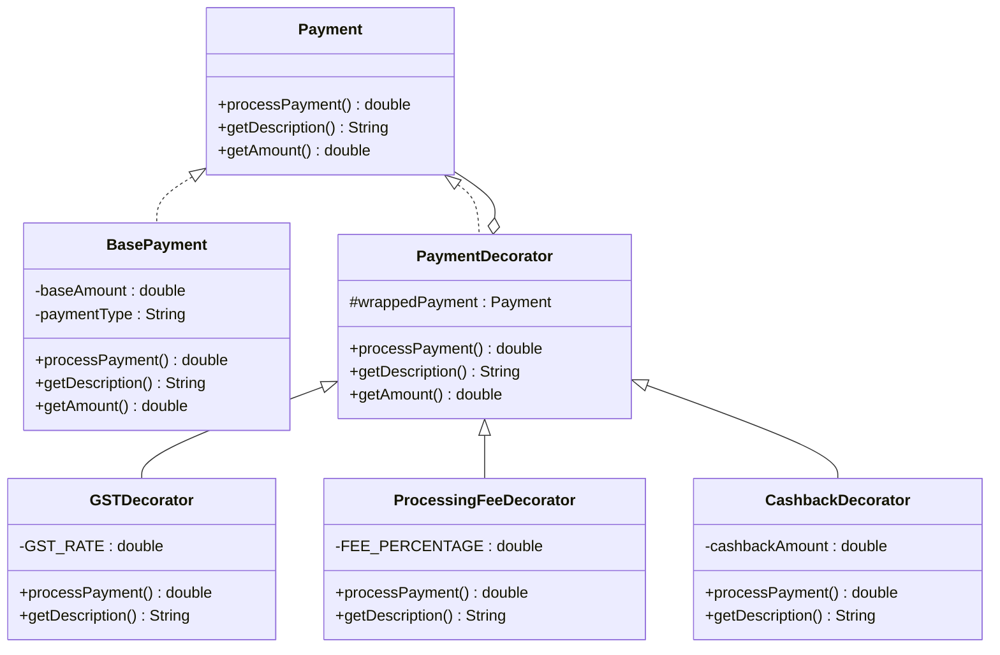

# Decorator Design Pattern 🎨

## Overview
The **Decorator Pattern** is a structural design pattern that allows you to add new behaviors or responsibilities to objects dynamically by wrapping them in decorator objects. It provides a flexible alternative to subclassing for extending functionality.

## Real-World Analogy 🌍
Think of **ordering coffee** at a café:
- **Base**: Simple black coffee (₹50)
- **Decorators**: You can add extras:
  - + Milk (₹20)
  - + Sugar (₹5)
  - + Whipped Cream (₹30)
  - + Chocolate Syrup (₹15)

Each addition wraps the previous item, and the final price is the sum of all additions. You don't create separate classes like `CoffeeWithMilk`, `CoffeeWithMilkAndSugar`, etc.—that would be a **class explosion**!

---

## Problem It Solves ❌

### Without Decorator Pattern (Inheritance Nightmare):
```java
// Base class
class Payment { }

// Need separate classes for every combination!
class PaymentWithGST extends Payment { }
class PaymentWithFee extends Payment { }
class PaymentWithGSTAndFee extends Payment { }
class PaymentWithGSTAndFeeAndCashback extends Payment { }
class PaymentWithGSTAndFeeAndCashbackAndInternational extends Payment { }
// ... This gets out of control quickly!
```

**Problems:**
- ❌ **Class explosion**: Need a class for every combination
- ❌ **Inflexible**: Can't add/remove features at runtime
- ❌ **Hard to maintain**: Changing one feature affects all combinations
- ❌ **Code duplication**: Similar logic repeated across many classes

### With Decorator Pattern:
```java
// Start with base payment
Payment payment = new BasePayment(10000, "UPI");

// Dynamically add features by wrapping
payment = new GSTDecorator(payment);
payment = new ProcessingFeeDecorator(payment);
payment = new CashbackDecorator(payment, 500);

// Process the wrapped payment
double finalAmount = payment.processPayment();
```

**Benefits:**
- ✅ **No class explosion**: Combine features flexibly
- ✅ **Runtime flexibility**: Add/remove decorators dynamically
- ✅ **Easy to extend**: Add new decorators without modifying existing code
- ✅ **Single Responsibility**: Each decorator has one job

---

## Structure 🏗️



### Components:

1. **Component Interface** ([Payment.java](file:///path/to/project/design-patterns/structural/decorator/Payment.java))
   - Defines common interface for components and decorators
   - Methods: `processPayment()`, `getDescription()`, `getAmount()`

2. **Concrete Component** ([BasePayment.java](file:///path/to/project/design-patterns/structural/decorator/BasePayment.java))
   - The core object being decorated
   - Represents a basic payment without additions

3. **Abstract Decorator** ([PaymentDecorator.java](file:///path/to/project/design-patterns/structural/decorator/PaymentDecorator.java))
   - Implements Payment interface
   - Contains a reference to Payment (wrappedPayment)
   - Delegates calls to wrapped object

4. **Concrete Decorators**
   - [GSTDecorator.java](file:///path/to/project/design-patterns/structural/decorator/GSTDecorator.java) - Adds 18% GST
   - [ProcessingFeeDecorator.java](file:///path/to/project/design-patterns/structural/decorator/ProcessingFeeDecorator.java) - Adds 0.5% fee (max ₹500)
   - [CashbackDecorator.java](file:///path/to/project/design-patterns/structural/decorator/CashbackDecorator.java) - Applies cashback discount
   - [InternationalFeeDecorator.java](file:///path/to/project/design-patterns/structural/decorator/InternationalFeeDecorator.java) - Adds 2% international fee

---

## Fintech Use Cases 💰

### 1. **Payment Processing** (Our Example)
Add fees, taxes, and discounts to transactions dynamically

### 2. **Loan Products**
Start with basic loan, add insurance, processing fee, prepayment option

### 3. **Investment Accounts**
Basic account + SIP + Tax saving + Automatic rebalancing

### 4. **Insurance Policies**
Base policy + Riders (critical illness, accidental death, etc.)

### 5. **Subscription Services**
Basic plan + Premium features + Ad-free + Priority support

---

## When to Use Decorator Pattern? 🤔

✅ **Use when:**
- You need to add responsibilities to objects dynamically
- Extension by subclassing is impractical (class explosion)
- You want to add/remove features at runtime
- You need different combinations of features
- Following Open/Closed Principle (open for extension, closed for modification)

❌ **Don't use when:**
- You only have one or two variations
- All objects need the same additional functionality
- The wrapping overhead is too high
- You need to remove decorators in the middle of the chain

---

## How to Run 🚀

### From the `oops` directory (Recommended):

```bash
# Navigate to the oops directory
cd /path/to/project

# Compile with package structure
javac -d . design-patterns/structural/decorator/*.java

# Run the demo
java structural.decorator.DecoratorPatternDemo
```

### From the `decorator` directory:

```bash
# Navigate to the decorator pattern directory
cd /path/to/project/design-patterns/structural/decorator

# Compile all files
javac *.java

# Go back to oops directory to run
cd /path/to/project
java structural.decorator.DecoratorPatternDemo
```

---

## Key Principles 📖

### SOLID Principles Applied:

1. **Single Responsibility Principle (SRP)**
   - Each decorator has one responsibility (add one type of charge)

2. **Open/Closed Principle (OCP)**
   - Open for extension: Add new decorators without modifying existing code
   - Closed for modification: Base payment and existing decorators unchanged

3. **Liskov Substitution Principle (LSP)**
   - Decorators can substitute for the base Payment object
   - Client code doesn't know if it's working with decorated or base object

4. **Dependency Inversion Principle (DIP)**
   - Decorators depend on Payment interface, not concrete classes

---

## Decorator Stacking Examples 📚

### Example 1: Domestic Purchase
```java
Payment payment = new BasePayment(10000, "UPI");
payment = new GSTDecorator(payment);
payment = new ProcessingFeeDecorator(payment);
// Result: ₹11,859
```

### Example 2: Promotional Purchase
```java
Payment payment = new BasePayment(10000, "Card");
payment = new GSTDecorator(payment);
payment = new ProcessingFeeDecorator(payment);
payment = new CashbackDecorator(payment, 500);
// Result: ₹11,359
```

### Example 3: International Purchase
```java
Payment payment = new BasePayment(10000, "International Card");
payment = new GSTDecorator(payment);
payment = new ProcessingFeeDecorator(payment);
payment = new InternationalFeeDecorator(payment, "USD");
// Result: ₹12,116.18
```

---

## Decorator vs Strategy vs Other Patterns 🤔

| Aspect | Decorator | Strategy | Adapter |
|--------|-----------|----------|---------|
| **Category** | Structural | Behavioral | Structural |
| **Purpose** | Add responsibilities | Change algorithm | Convert interface |
| **Wrapping** | Wraps same interface | Doesn't wrap | Wraps different interface |
| **Multiple** | Can stack many | Usually one strategy | Usually one adapter |
| **Example** | Add fees to payment | Choose payment method | Adapt old API to new |

---

## Common Pitfalls ⚠️

### 1. **Order Sensitivity**
```java
// These might give different results
payment = new GSTDecorator(new CashbackDecorator(base, 100));
payment = new CashbackDecorator(new GSTDecorator(base), 100);
```
**Solution:** Document the expected order or make decorators commutative

### 2. **Too Many Decorators**
Creating too many small decorators can make code hard to follow
**Solution:** Group related functionality

### 3. **Breaking the Interface**
Decorators adding methods not in the interface
**Solution:** Stick to the interface contract

### 4. **Performance Overhead**
Each decorator adds a layer of indirection
**Solution:** Use decorators judiciously for performance-critical code

---

## Extending the Pattern 🔧

### Adding a New Decorator (e.g., Insurance Fee):

```java
public class InsuranceFeeDecorator extends PaymentDecorator {
    private double insuranceRate = 0.01; // 1%
    
    public InsuranceFeeDecorator(Payment payment) {
        super(payment);
    }
    
    @Override
    public double processPayment() {
        double currentAmount = wrappedPayment.processPayment();
        double insuranceFee = currentAmount * insuranceRate;
        return currentAmount + insuranceFee;
    }
    
    @Override
    public String getDescription() {
        return wrappedPayment.getDescription() + " + Insurance (1%)";
    }
}
```

**That's it!** No need to modify BasePayment or other decorators.

---

## Related Patterns 🔗

- **Composite Pattern** - Both use recursive composition, but different purpose
- **Strategy Pattern** - Changes algorithm, Decorator adds functionality
- **Proxy Pattern** - Controls access, Decorator adds features
- **Adapter Pattern** - Changes interface, Decorator keeps same interface

---

## Summary 📝

The Decorator Pattern is perfect for fintech applications where:
- Transactions need multiple optional additions (fees, taxes, discounts)
- Feature combinations are numerous and unpredictable
- Adding new charges/features should be easy
- Runtime flexibility is important

**Key Takeaways:**
- ✅ Avoid class explosion from inheritance
- ✅ Add features dynamically at runtime
- ✅ Stack decorators for complex combinations
- ✅ Follow Open/Closed Principle
- ⚠️ Be mindful of decorator order
- ⚠️ Don't overuse (adds complexity)

**Remember:** Decorator Pattern = Dynamic feature addition through wrapping! 🎨
